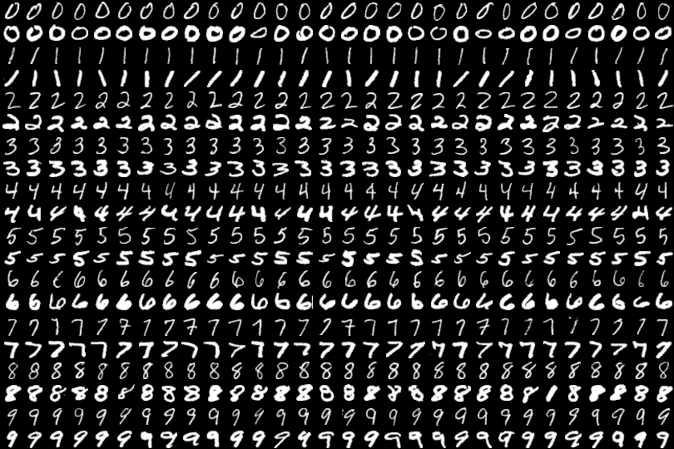
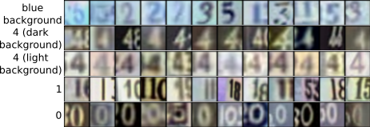

# Bidirectional-InfoGAN

The work presented here was done at the [Knowledge Technology Research Group](https://www.inf.uni-hamburg.de/en/inst/ab/wtm/ "Knowledge Technology Research Group") at the University of Hamburg and submitted as a conference contribution to the [ESANN 2018](https://www.elen.ucl.ac.be/esann/).

For further details on the network architectures and the hyperparameters used during the experiments see: [Architectures and Hyperparameters](./architectures/network-architectures.pdf)

Contents:
* [Additional Results](#additional-results): Additional random samples from the respective test sets according to certain characteristics represented by the values in c.
    * [MNIST Data Set](#mnist-data-set)
    * [CelebA Data Set](#celeba-data-set)
    * [SVHN Data Set](#svhn-data-set)
* [Images from the Paper](#images-from-the-paper): The original images used in the paper.
    * [MNIST Images](#mnist-images)
    * [CelebA Images](#celeba-images)
    * [SVHN Images](#svhn-images)

## Additional Results
### MNIST Data Set
Additional samples according to the individual values of the categorical variable c1:

Additional samples from the continuous variable c2 (stroke width):
uneven rows show the samples according to the minimum values, even rows show samples according to the maximum values of c2 of each categorical value

Additional samples from the continuous variable c3 (digit rotation):
uneven rows show the samples according to the minimum values, even rows show samples according to the maximum values of c3 of each categorical value

### CelebA Data Set
#### Categorical Variables
Here we show images that are sampled from the CelebA test set according to a categorical value of the variables c1, ..., c4.

Images with high confidence in the presence of glasses:

Images with high confidence in the presence of hats:

Images with high confidence in blond hair:

Images with high confidence in a person looking to the right:

Images with high confidence in a person looking to the left:

Images with high confidence in a person with a darker skin tone:

Images with high confidence in a person with their mouth open:

Images with high confidence in blue background:

Images with high confidence in red background:

#### Continuous Variables
Here we show images that are sampled from the CelebA test set according to their value (minimum and maximum) for the continuous variables c5, ..., c8. In each image the first two rows show images where the value of the given continuous variable is small, while the second two rows show images where the continuous variable's value is large.

From not smiling to smiling:  

From light hair to darker hair:  

From light background to darker background:

### SVHN Data Set

## Images from the Paper
### MNIST Images

### CelebA Images

### SVHN Images

